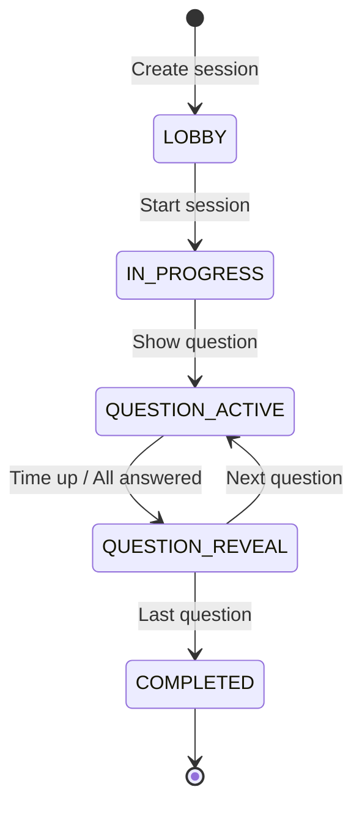

## Platform Hierarchy

Wovser.AI is organized in a multi-tenant structure:

```
Tenant (Organization)
└── Projects
    ├── Quizzes
    ├── Assessments
    └── Code Challenges
        └── Sessions / Attempts
            └── Submissions
```

### Tenants

A **tenant** represents an organization or company. Each tenant has:
- Isolated data and content
- Billing and subscription management
- User management and roles
- Custom branding options (Enterprise)

### Projects

**Projects** are containers for organizing related content. Use projects to:
- Group quizzes by course or department
- Separate hiring assessments by role
- Organize training materials by topic

### Content Types

<CardGroup cols={3}>
  <Card title="Quizzes" icon="gamepad">
    Live, multiplayer trivia-style games with real-time leaderboards
  </Card>
  <Card title="Assessments" icon="clipboard-list">
    Structured evaluations with scoring rubrics and optional proctoring
  </Card>
  <Card title="Code Challenges" icon="terminal">
    Programming tasks executed in sandboxed VS Code environments
  </Card>
</CardGroup>

---

## User Roles

### Tenant Roles

| Role | Permissions |
|------|-------------|
| **Owner** | Full access, billing, user management |
| **Admin** | Manage projects, users, settings |
| **Member** | Create and manage own content |

### Project Roles

| Role | Permissions |
|------|-------------|
| **Owner** | Full project control, can delete project |
| **Contributor** | Create/edit content, manage sessions |
| **Reviewer** | View results, cannot edit content |
| **Learner** | Take quizzes/assessments only |

---

## Sessions & Attempts

### Session Lifecycle



<AccordionGroup>
  <Accordion title="LOBBY" icon="door-open">
    Waiting room where participants join via PIN code before the session starts.
  </Accordion>
  <Accordion title="IN_PROGRESS" icon="play">
    Session is active. Questions are presented sequentially.
  </Accordion>
  <Accordion title="QUESTION_ACTIVE" icon="circle-question">
    A question is currently displayed and accepting answers.
  </Accordion>
  <Accordion title="QUESTION_REVEAL" icon="eye">
    Answer reveal phase showing correct answer and current standings.
  </Accordion>
  <Accordion title="COMPLETED" icon="flag-checkered">
    Session ended. Final results and analytics available.
  </Accordion>
</AccordionGroup>

### Attempts

An **attempt** is a single user's participation in a session:

- Each attempt has a unique ID
- Tracks all answers and timestamps
- Calculates individual scores
- Records proctoring data (if enabled)

---

## Scoring

### Quiz Scoring

Quizzes use point-based scoring:

| Factor | Points |
|--------|--------|
| Correct answer | Base points (default: 1000) |
| Speed bonus | Up to 500 extra points for fast answers |
| Streak bonus | Multiplier for consecutive correct answers |

### Assessment Scoring

Assessments support multiple scoring methods:

<Tabs>
  <Tab title="Percentage">
    Simple percentage of correct answers.
    ```
    Score = (Correct / Total) × 100
    ```
  </Tab>
  <Tab title="Weighted">
    Questions have different point values.
    ```
    Score = Σ(Points Earned) / Σ(Max Points) × 100
    ```
  </Tab>
  <Tab title="Rubric-Based">
    Open-ended questions scored against criteria with AI assistance.
  </Tab>
</Tabs>

### Code Challenge Scoring

Code challenges are evaluated on:

1. **Test Cases** - Automated pass/fail against predefined tests
2. **Code Quality** - AI-powered review for best practices
3. **Performance** - Execution time and memory usage (optional)

---

## Execution Environments

Code challenges run in isolated **workspaces**:

<Info>
Each workspace is a containerized VS Code instance with:
- Pre-installed language runtimes
- Read-only starter files
- Network isolation
- Time and resource limits
</Info>

### Supported Languages

| Language | Version | Runtime |
|----------|---------|---------|
| Python | 3.11 | CPython |
| JavaScript | ES2023 | Node.js 20 |
| TypeScript | 5.x | ts-node |
| Java | 21 | OpenJDK |
| C# | .NET 8 | dotnet |
| Go | 1.21 | go |
| Rust | 1.75 | rustc |
| Shell | Bash 5 | bash |
| PowerShell | 7.x | pwsh |

---

## Integrations

Wovser.AI connects with external systems through:

<CardGroup cols={2}>
  <Card title="LTI 1.3" icon="graduation-cap">
    Launch from Canvas, Moodle, Blackboard with grade passback
  </Card>
  <Card title="SSO (SAML/OIDC)" icon="key">
    Single sign-on with Azure AD, Okta, Google Workspace
  </Card>
  <Card title="SCIM 2.0" icon="users">
    Automated user provisioning and deprovisioning
  </Card>
  <Card title="Webhooks" icon="webhook">
    Real-time event notifications to your systems
  </Card>
</CardGroup>

---

## Next Steps

<CardGroup cols={2}>
  <Card
    title="Create Your First Quiz"
    icon="rocket"
    href="/quickstart"
  >
    Get started with a hands-on tutorial
  </Card>
  <Card
    title="Explore the API"
    icon="code"
    href="/api-reference/introduction"
  >
    Build custom integrations
  </Card>
</CardGroup>
