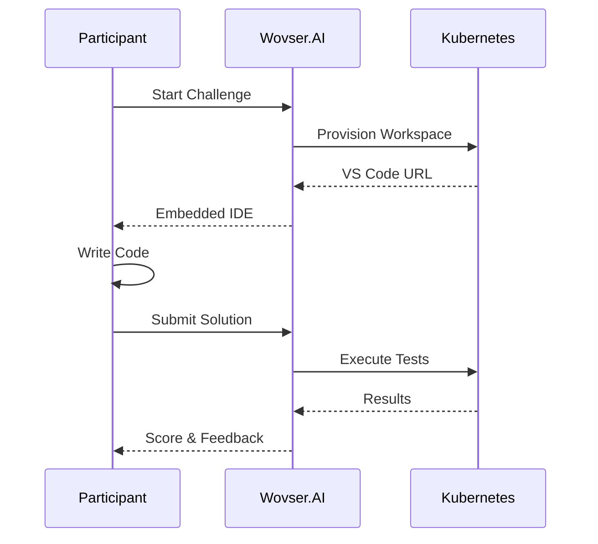

Code challenges let you evaluate programming skills in secure, sandboxed VS Code environments. Participants write and run real code against test cases.

## How It Works



<Info>
Each participant gets an isolated VS Code workspace with:
- Pre-installed language runtime
- Read-only starter files
- Editable solution files
- Terminal access (optional)
- Network isolation
</Info>

## Create a Code Challenge

<Steps>
  <Step title="Start Challenge Creation">
    Navigate to your project and click **Create New** → **Code Challenge**.
  </Step>
  
  <Step title="Configure Basics">
    | Setting | Description |
    |---------|-------------|
    | **Title** | Challenge name |
    | **Description** | Problem statement (Markdown supported) |
    | **Difficulty** | Easy, Medium, Hard |
    | **Time Limit** | Maximum time allowed |
    | **Language** | Programming language(s) |
  </Step>
  
  <Step title="Write the Problem">
    Create a clear problem statement:
    
    ```markdown
    ## Two Sum
    
    Given an array of integers `nums` and an integer `target`, 
    return indices of the two numbers that add up to `target`.
    
    ### Constraints
    - 2 ≤ nums.length ≤ 10⁴
    - -10⁹ ≤ nums[i] ≤ 10⁹
    - Each input has exactly one solution
    
    ### Examples
    
    **Input:** nums = [2,7,11,15], target = 9
    **Output:** [0,1]
    **Explanation:** nums[0] + nums[1] = 2 + 7 = 9
    ```
    
    <Tip>
      Use clear examples, explain constraints, and consider edge cases.
    </Tip>
  </Step>
  
  <Step title="Provide Starter Code">
    Give participants a starting point:
    
    <Tabs>
      <Tab title="Python">
        ```python
        def two_sum(nums: list[int], target: int) -> list[int]:
            """
            Find two numbers that add up to target.
            
            Args:
                nums: List of integers
                target: Target sum
                
            Returns:
                Indices of the two numbers
            """
            # Your code here
            pass
        ```
      </Tab>
      <Tab title="JavaScript">
        ```javascript
        /**
         * Find two numbers that add up to target.
         * @param {number[]} nums - Array of integers
         * @param {number} target - Target sum
         * @returns {number[]} Indices of the two numbers
         */
        function twoSum(nums, target) {
            // Your code here
        }
        
        module.exports = { twoSum };
        ```
      </Tab>
      <Tab title="TypeScript">
        ```typescript
        function twoSum(nums: number[], target: number): number[] {
            // Your code here
            return [];
        }
        
        export { twoSum };
        ```
      </Tab>
    </Tabs>
  </Step>
  
  <Step title="Define Test Cases">
    Create test cases to validate solutions:
    
    ```json
    {
      "testCases": [
        {
          "name": "Basic case",
          "input": {"nums": [2, 7, 11, 15], "target": 9},
          "expected": [0, 1],
          "points": 20,
          "visible": true
        },
        {
          "name": "Negative numbers",
          "input": {"nums": [-1, -2, -3, -4, -5], "target": -8},
          "expected": [2, 4],
          "points": 20,
          "visible": true
        },
        {
          "name": "Large array",
          "input": {"nums": "...large array...", "target": 12345},
          "expected": [100, 9999],
          "points": 30,
          "visible": false
        }
      ]
    }
    ```
    
    <Info>
      **Visible** test cases are shown to participants. **Hidden** cases prevent hardcoding.
    </Info>
  </Step>
  
  <Step title="Configure Execution Settings">
    <AccordionGroup>
      <Accordion title="Resource Limits" icon="gauge">
        - **Timeout**: Max execution time (default: 10s)
        - **Memory**: Max RAM (default: 256MB)
        - **CPU**: Core allocation
      </Accordion>
      <Accordion title="Allowed Features" icon="toggle-on">
        - **Terminal**: Allow shell access
        - **File Creation**: Allow new files
        - **Network**: Block or allow (usually blocked)
        - **Extensions**: Pre-install VS Code extensions
      </Accordion>
      <Accordion title="Scoring" icon="star">
        - **Test-based**: Points per passing test
        - **All-or-nothing**: Full points only if all pass
        - **Code quality**: AI bonus for clean code
      </Accordion>
    </AccordionGroup>
  </Step>
  
  <Step title="Add Reference Solution (Optional)">
    Provide a solution for auto-validation and AI feedback:
    
    ```python
    def two_sum(nums: list[int], target: int) -> list[int]:
        seen = {}
        for i, num in enumerate(nums):
            complement = target - num
            if complement in seen:
                return [seen[complement], i]
            seen[num] = i
        return []
    ```
  </Step>
  
  <Step title="Save Challenge">
    Click **Save** to store your code challenge.
  </Step>
</Steps>

## Supported Languages

| Language | Version | Test Framework |
|----------|---------|----------------|
| Python | 3.11 | pytest |
| JavaScript | ES2023 | Jest |
| TypeScript | 5.x | Jest |
| Java | 21 | JUnit 5 |
| C# | .NET 8 | xUnit |
| Go | 1.21 | testing |
| Rust | 1.75 | cargo test |
| Shell | Bash 5 | bats |
| PowerShell | 7.x | Pester |
| SQL | PostgreSQL 15 | Query comparison |

## Launch a Challenge Session

<Tabs>
  <Tab title="Individual Assessment">
    Send personalized invitations:
    1. Click **Invite Candidates**
    2. Enter email addresses
    3. Set deadline
    4. Send invitations
  </Tab>
  <Tab title="Live Coding Event">
    Host a timed coding competition:
    1. Click **Start Session**
    2. Share PIN code
    3. Participants join lobby
    4. Start when ready
    5. Monitor in real-time
  </Tab>
  <Tab title="Self-Paced Practice">
    Make available for practice:
    1. Toggle **Practice Mode**
    2. Remove time limits
    3. Enable solution hints
    4. Share public link
  </Tab>
</Tabs>

## Participant Experience

What participants see:

<Frame>
  
</Frame>

1. **Problem Statement** - Left panel with instructions
2. **Code Editor** - VS Code with syntax highlighting
3. **Terminal** - Run code and see output
4. **Test Results** - See which tests pass/fail
5. **Submit Button** - Final submission for scoring

## Review Submissions

<Steps>
  <Step title="View Submissions List">
    See all submissions with:
    - Participant name/email
    - Submission time
    - Test results (X/Y passed)
    - Score
    - Status (Passed/Failed/In Review)
  </Step>
  
  <Step title="Review Individual Code">
    For each submission:
    - View submitted code with diff
    - See test case results
    - Read AI code review feedback
    - View execution logs
    - Check proctoring events (if enabled)
  </Step>
  
  <Step title="Compare Solutions">
    Compare multiple submissions:
    - Side-by-side code diff
    - Performance comparison (time, memory)
    - Detect potential plagiarism
  </Step>
  
  <Step title="Export Results">
    Download:
    - **CSV**: Scores and metadata
    - **ZIP**: All submitted code
    - **PDF**: Individual feedback reports
  </Step>
</Steps>

## AI Code Review

Wovser.AI provides AI-powered feedback on submissions:

<CardGroup cols={2}>
  <Card title="Correctness" icon="circle-check">
    Does the code solve the problem correctly?
  </Card>
  <Card title="Efficiency" icon="bolt">
    Time and space complexity analysis
  </Card>
  <Card title="Readability" icon="eye">
    Code style, naming, documentation
  </Card>
  <Card title="Best Practices" icon="star">
    Language-specific patterns and idioms
  </Card>
</CardGroup>

## Best Practices

<Tip>
**For effective code challenges:**
- Start with clear, unambiguous problem statements
- Include 2-3 visible test cases as examples
- Add hidden edge cases to prevent hardcoding
- Set realistic time limits (30min-2hr typical)
- Provide starter code to reduce boilerplate time
</Tip>

<Warning>
**Common issues:**
- Ambiguous problem description
- Missing edge cases in tests
- Too strict output format requirements
- Insufficient time for complexity
- Not testing locally before publishing
</Warning>

## Next Steps

<CardGroup cols={2}>
  <Card
    title="Integrate with ATS"
    icon="users"
    href="/integrations/greenhouse"
  >
    Connect to Greenhouse or Lever
  </Card>
  <Card
    title="View Analytics"
    icon="chart-bar"
    href="/hosts/analytics"
  >
    Analyze challenge performance
  </Card>
</CardGroup>
