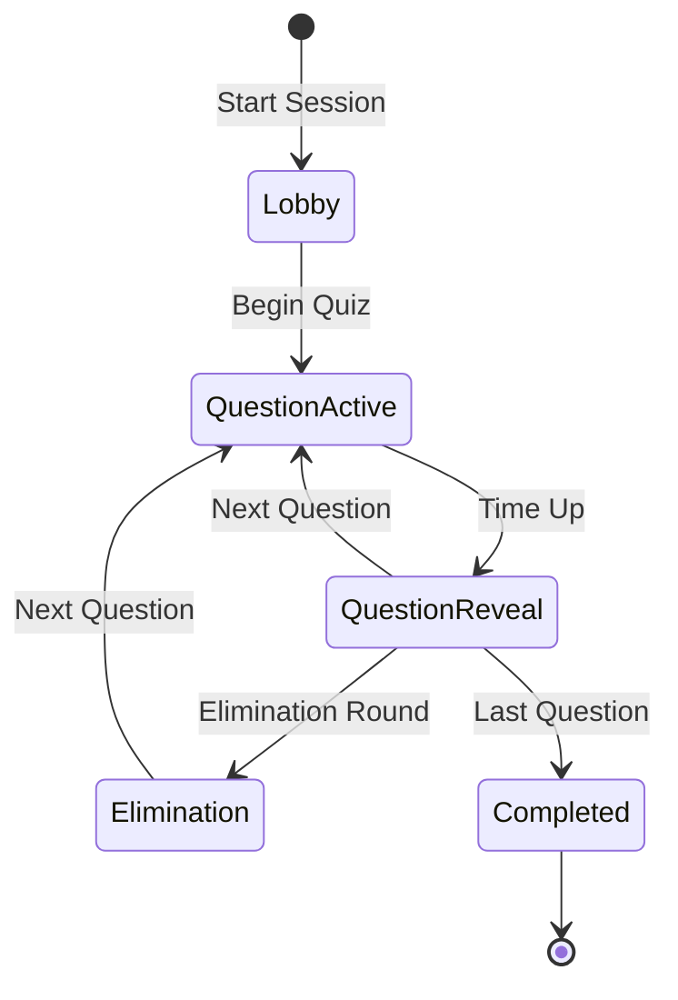

Live sessions transform quizzes into interactive, competitive experiences. Perfect for training, team building, classrooms, and events.

## Session Types

<CardGroup cols={2}>
  <Card title="Competitive Quiz" icon="trophy">
    Real-time leaderboard, speed bonuses, eliminations
  </Card>
  <Card title="Team Mode" icon="users">
    Groups compete together, combined scores
  </Card>
  <Card title="Practice Mode" icon="book">
    Self-paced, no leaderboard, instant feedback
  </Card>
  <Card title="Survey Mode" icon="poll">
    Collect opinions, no correct answers
  </Card>
</CardGroup>

## Starting a Session

<Steps>
  <Step title="Select Content">
    Choose a quiz from your project.
  </Step>
  
  <Step title="Configure Session">
    <AccordionGroup>
      <Accordion title="Game Settings" icon="gamepad">
        - **Nickname required**: Participants choose display names
        - **Anonymous mode**: Hide names on leaderboard
        - **Late join**: Allow joining after start
        - **Auto-advance**: Questions progress automatically
      </Accordion>
      <Accordion title="Scoring Rules" icon="calculator">
        - **Speed bonus**: Points for fast answers
        - **Streak multiplier**: Bonus for consecutive correct
        - **Elimination mode**: Bottom % eliminated per round
      </Accordion>
      <Accordion title="Display Options" icon="desktop">
        - **Show answers**: After each question or at end
        - **Show leaderboard**: Between questions
        - **Podium celebration**: Top 3 animation at end
      </Accordion>
    </AccordionGroup>
  </Step>
  
  <Step title="Launch Lobby">
    Click **Start Session** to open the lobby.
    
    <Frame>
      
    </Frame>
    
    Share the join information:
    - **PIN**: 6-digit code at `app.wovser.ai/join`
    - **Link**: Direct URL
    - **QR Code**: For mobile devices
  </Step>
  
  <Step title="Wait for Participants">
    Watch the lobby fill up:
    - See participant count
    - View who has joined
    - Test your setup
  </Step>
  
  <Step title="Begin Quiz">
    When ready, click **Start Quiz**.
  </Step>
</Steps>

## Host Controls

During the session, you have full control:

### Control Bar

| Button | Action |
|--------|--------|
| ▶️ **Next** | Advance to next question |
| ⏸️ **Pause** | Freeze timer |
| ⏭️ **Skip** | Skip question (no scoring) |
| 🔇 **Mute LB** | Hide leaderboard |
| 🛑 **End** | End session immediately |

### Keyboard Shortcuts

| Key | Action |
|-----|--------|
| `Space` | Next/Start |
| `P` | Pause/Resume |
| `L` | Toggle leaderboard |
| `Esc` | End session |

## Session States

### Lobby
- Participants join with PIN
- Host can see who's connected
- Music plays (optional)

### Question Active
- Timer counting down
- Participants selecting answers
- Response count updating

### Question Reveal
- Correct answer highlighted
- Point awards shown
- Leaderboard update

### Elimination (Optional)
- Bottom X% eliminated
- Dramatic reveal
- Survivors continue

### Completed
- Final standings
- Podium celebration
- Results available

## Participant View

What participants see on their devices:

<Frame>
  
</Frame>

1. **Question** - Displayed with timer
2. **Options** - Tap to select answer
3. **Feedback** - Instant correct/incorrect
4. **Rank** - Current position
5. **Points** - Running score

## Advanced Features

### Team Mode

<Steps>
  <Step title="Enable Teams">
    In session settings, toggle **Team Mode**.
  </Step>
  
  <Step title="Configure Teams">
    - **Random**: Auto-assign participants
    - **Manual**: Host assigns teams
    - **Self-select**: Participants choose
  </Step>
  
  <Step title="Team Scoring">
    - Average of team members
    - Or sum of team scores
    - Team leaderboard displayed
  </Step>
</Steps>

### Elimination Mode

Gradually eliminate participants:

1. Set elimination percentage (e.g., bottom 10%)
2. After X questions, eliminate lowest scorers
3. Eliminated participants watch but can't score
4. Final participants compete for top spots

### Music & Sound

Add audio to your sessions:

- **Lobby music**: While waiting for participants
- **Question countdown**: Ticking sound effects
- **Correct/Wrong**: Audio feedback
- **Leaderboard**: Dramatic reveal music

## Monitoring Tools

### Real-Time Analytics

During the session, view:

<CardGroup cols={3}>
  <Card title="Response Rate" icon="chart-line">
    % of participants answering
  </Card>
  <Card title="Accuracy" icon="bullseye">
    % correct per question
  </Card>
  <Card title="Avg Time" icon="clock">
    Average response time
  </Card>
</CardGroup>

### Connection Status

Monitor participant connections:

- 🟢 Connected
- 🟡 Reconnecting
- 🔴 Disconnected

<Info>
Participants automatically reconnect if they lose connection. Their progress is saved.
</Info>

## After the Session

### Results Screen

Displayed to all participants:

1. **Podium** - Top 3 with celebration
2. **Full Leaderboard** - All participants ranked
3. **Stats** - Individual performance summary
4. **Replay** - Option to review questions

### Host Actions

- **Download Results**: CSV with all responses
- **Share Standings**: Link to public leaderboard
- **Send Certificates**: To top performers
- **Review Analytics**: Deep-dive into performance

## Best Practices

<Tip>
**For engaging sessions:**
- Test your setup before participants join
- Start with an easy warm-up question
- Maintain energy with varied difficulty
- Use the pause feature if technical issues arise
- End with a memorable hard question
</Tip>

<Warning>
**Avoid these issues:**
- Starting before all participants have joined
- Questions too long for the time limit
- Not having a backup plan for technical issues
- Forgetting to enable late join for latecomers
</Warning>

## Troubleshooting

<AccordionGroup>
  <Accordion title="Participants can't join" icon="triangle-exclamation">
    - Verify PIN is correct
    - Check session hasn't started (if late join disabled)
    - Try the direct link instead
    - Refresh the host page
  </Accordion>
  <Accordion title="Leaderboard not updating" icon="triangle-exclamation">
    - Check browser console for errors
    - Verify WebSocket connection
    - Refresh host page
  </Accordion>
  <Accordion title="Timer not advancing" icon="triangle-exclamation">
    - Check if paused
    - Verify auto-advance settings
    - Click Next manually
  </Accordion>
</AccordionGroup>

## Next Steps

<CardGroup cols={2}>
  <Card
    title="Analyze Results"
    icon="chart-bar"
    href="/hosts/analytics"
  >
    Deep-dive into session analytics
  </Card>
  <Card
    title="Create Assessments"
    icon="clipboard-check"
    href="/hosts/creating-assessments"
  >
    Build async evaluations
  </Card>
</CardGroup>
